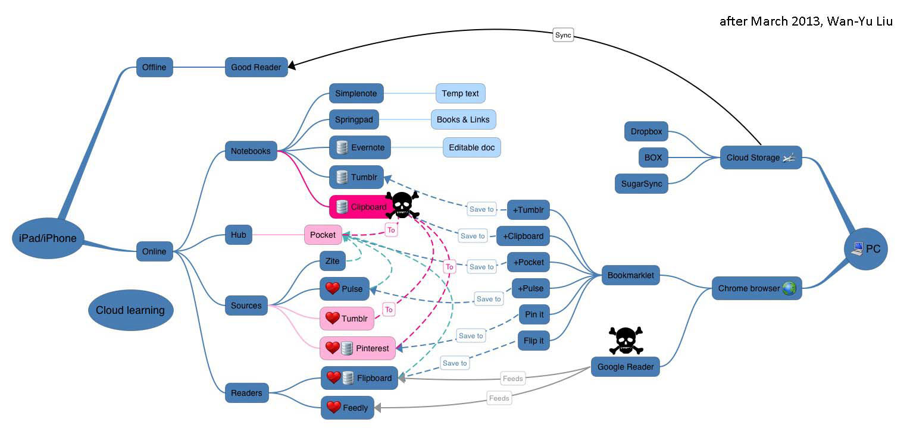
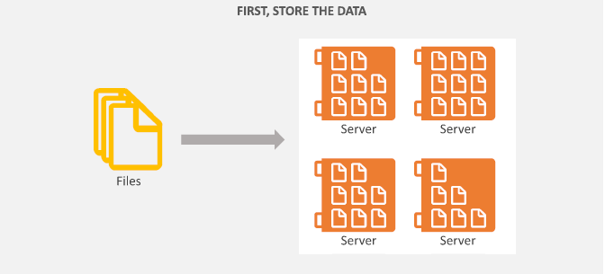
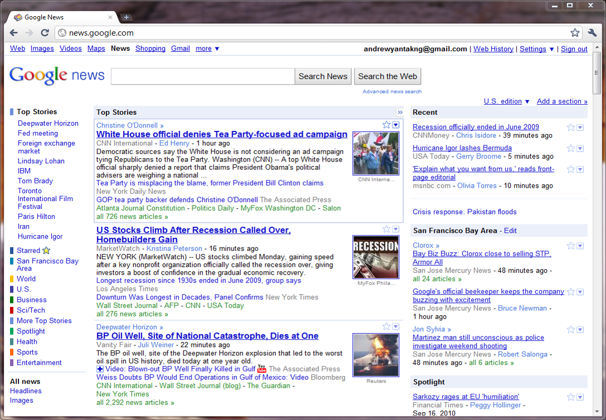

## 物联网是什么 (Internet Of things) | 物联网应用全貌

<!-- > - Eat eggs -->
<!-- > - Drink coffee -->

<!--  -->

## 物联网(Internet Of Things)

* 实体物件可以相互沟通
* 物件标签能被识e、定位、启用与禁用
* RFID、传感器网络
*  …

## 云计算 Cloud Computing

1. 你认为什么是云计算？
    - Baidu, Ali, Tencent, Facebook, Google Drive, Dropbox, OneDrive, ..
    - 百度云, 阿里云, 腾讯云...
    - Gmail, Outlook.com
    - Google Calendar, Evernote
    - Flickr
    - More
2. 基本上，有云就有端，缺一不可。
3. 但是人云亦云?(XaaS service)

## 2008的云是...

This is my *note*.

- It can contain markdown
- like this list

<!--  -->

<!--  -->

## 2010的云是...
<!-- 
 -->
<!-- This text is red -->
<!-- 
 -->

<!--  -->

## 2013的云是...
<!-- 
 -->
<!-- This text is red -->
<!-- 
 -->

<!--  -->

## 而今年的云是这样的
<!-- 
 -->
<!-- This text is red -->
<!-- 
 -->

<!--  -->

## 云计算 | Whats's the Cloud
<!-- 
 -->
<!-- This text is centered. -->
<!-- 
 -->

  
  
  <h2>什么是云?</h2>
  

  
一种运用网际扩展与多种不同的设备应用相连的运算方法.

## 云计算 | What's the End 

  <!--  -->
  
  
  <h2>什么是端?</h2>
  

  
一种运用网际网路与云服务(Cloud Service)或其他设备相连以存取其资源的设备.

## 物联网与云计算的结合

* 规模化应是云计算应用在物联网上的关键

* 实际的技术支撑与产业链建设
    * 网络在物联网上的扩展(Ipv6, RFID, 无线传感网络)
    * IT虚拟化的技术
    * 物联网与云端运算平台的管理、控制及运用
    * 合适的商业模式和实际服务

* 传统计算机厂商和IT厂商能快速进入终端用户服务领域

* 数据中心需要可靠且严谨的虚拟化平台来作支持

## 大数据（Big Data）

## What is Big Data?

<!--  -->

## Big Data Plateform | Hadoop

<!--  -->

## MapReduce | Move Code to the Data

<!--  -->

## So How Does It Work? | example with javascrip

<!--  -->

## Intelligence Home && IoT Home  

  <video width="640" height="480" controls="controls">
    <source src="IoT.mp4" type="video/mp4" />
  </video>

## Okay,Let's Explore Machine Learning | 什么是机器学习？

* 讲完了物联网的基础架构和其必需的云计算及其大数据平台这两个主要组件的的基本原理后，总感觉少了点什么？

* Thinking... 对啊，应该有人要问了，收集那么多数据干嘛用啊？吃吗？ :-(

* 不错，下面开始简要介绍目前我正在做的一些工作，因为它要引出我们这个主题的大Boss.  :-)

* 在进入主题之前，我想问一下

    1. IOT 是一个生产联网硬件的过程
    2. IOT 是一个有关寻找与提供洞见的过程

* 今天的生产的数据和杂讯是明天的洞见

## Project About AI | 神经网络算法实现纸币分类器

<video width="620" height="450" controls="controls">
<source src="IoT.mp4" type="video/mp4" />
</video>

## Project About AI |人脸检测和识别

<video width="620" height="440" controls="controls">
  <source src="perfect.mp4" type="video/mp4" />
</video>

## What's Machine Learning | 定义

假设用 *P* 来评估计算机程序在某任务类 *T* 上的性能，若一个程序通过利用经验 *E* 在 *T* 中任务上获得了性能改善，则我们就说关于 *T* 和 *P* ，该程序对 *E* 进行了学习.
*[Mitchell, 1997]*

机器学习系统  | 计算机系统
------------- | -------------
经验*E*是在历史数据的基础上积累 | 经验以数据在计算机上存储
学习        | 在已有经验的基础上建模
关于研究学习算法的        | 关于“算法”的学问

## What's Machine Learning | Application1

<!--  -->

## What's Machine Learning | Application2

<!--  -->

## What's Machine Learning | Application3

<!--  -->

## What's Machine Learning | Application4

  

Organize computing clusters

Social network analysis

Market segmentation

Astronomical data analysis

## What's Machine Learning | 模型

<!--  -->

## Resources-干货 | About Machine Learning,Big Data,Deep Learning,Computer Vision・・・
1. Machine Learning
    * [Machine Learning](https://coursera.com/machinelearning)
    * [CS229](http://cs229.stanford.edu/)
2. Compute Vision
    * [CS231](http://cs231n.stanford.edu/)

## Reference

